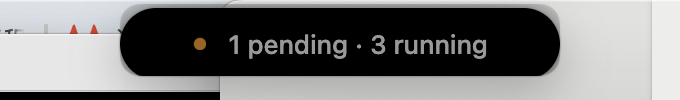
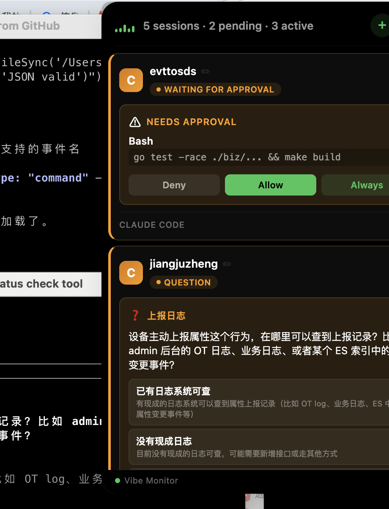

# Vibe Monitor

[English](README.md) | 中文

一款灵动岛风格的 macOS 菜单栏应用，实时监控你的 AI 编程会话。灵感来自 [Vibe Island](https://vibeisland.app/)。

同时追踪多个 Claude Code / Codex / Gemini 会话，任务完成或需要审批时即时通知，一键跳转到对应终端。

## 效果截图

| 收起状态（有待处理项） | 展开面板 |
|:---:|:---:|
|  |  |

## 功能特性

- **灵动岛 UI** — 平时隐藏为屏幕顶部一条细线，hover 或需要关注时自动展开
- **智能展开** — 有待审批或未读完成时保持展开，全部处理完自动收起
- **弹窗动画** — 新的待处理项出现时弹跳动画提醒
- **系统通知** — 任务完成和审批请求触发 macOS 原生通知，点击通知直接跳转
- **终端跳转** — 点击会话卡片跳转到对应的 iTerm2 标签页、GoLand 终端、VS Code 或 Cursor 窗口
- **会话重命名** — 双击或点击编辑图标给会话自定义名称，方便识别
- **未读追踪** — 蓝色标记未读完成，橙色标记待审批
- **新建会话** — 点击 + 按钮快速新开 iTerm2 窗口启动 Claude Code
- **多 Agent 支持** — 支持 Claude Code、Codex、Gemini、Cursor 等

## 环境要求

- macOS
- Node.js >= 18
- [Claude Code](https://docs.anthropic.com/en/docs/claude-code)（或其他支持的 AI 编程工具）

## 快速开始

```bash
# 克隆仓库
git clone https://github.com/NolongerAkid/VibeMonitor.git
cd VibeMonitor

# 安装依赖
npm install

# 安装 Claude Code hooks
npm run install-hooks

# 启动监控
npm start
```

就这么简单。监控器会出现在屏幕顶部，在任意终端打开 Claude Code 会话即可自动检测到。

## 工作原理

```
Claude Code hooks → bridge.js → Unix socket → Electron 应用 → 灵动岛 UI
```

1. **Hooks** — `install-hooks` 在 `~/.claude/settings.json` 中注册桥接脚本，监听 Claude Code 所有生命周期事件（会话开始/结束、工具调用、审批、完成等）
2. **Bridge** — 每个 hook 事件携带环境信息（终端类型、会话 ID、TTY）通过 Unix socket 发送到 `~/.vibe-monitor/run/monitor.sock`
3. **Monitor** — Electron 应用接收事件，维护会话状态，渲染灵动岛 UI
4. **通知** — 任务完成和审批请求时触发 macOS 原生通知

## 命令

| 命令 | 说明 |
|------|------|
| `npm start` | 启动监控 |
| `npm run demo` | 使用示例数据启动 |
| `npm run install-hooks` | 安装/更新 Claude Code hooks |

## 支持的终端

| 终端 | 跳转方式 | 自动检测 |
|------|:--------:|:--------:|
| iTerm2 | 精确到标签页 | 支持 |
| GoLand / JetBrains | 窗口级别 | 支持 |
| VS Code | 窗口级别 | 支持 |
| Cursor | 窗口级别 | 支持 |
| Apple Terminal | 窗口级别 | 支持 |

## 会话状态

| 状态 | 灵动岛 | 标识 |
|------|--------|------|
| 正在运行工具 | 收起（细线） | 绿色圆点 |
| 处理中 | 收起 | 绿色圆点 |
| 待审批 | **展开 + 弹跳动画** | 橙色圆点 + 橙色边框 |
| 已完成（未读） | **展开** | 蓝色圆点 + 蓝色边框 |
| 已完成（已读） | 收起 | 蓝色圆点 |
| 等待输入 | 收起 | 蓝色圆点 |

## 配置

Hooks 存储在 `~/.claude/settings.json` 中。如需卸载，删除 hooks 部分中包含 `vibe-monitor-bridge` 的条目即可。

Unix socket 路径：`~/.vibe-monitor/run/monitor.sock`

## 开发

```bash
# 带 DevTools 启动
npm start -- --dev

# 使用示例数据启动
npm run demo
```

## 许可证

MIT
